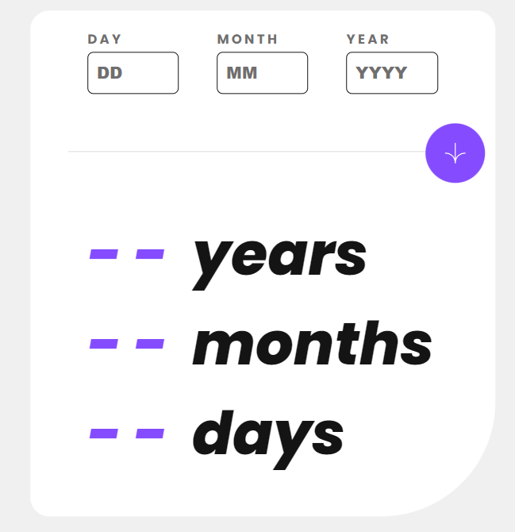

# Frontend Mentor - Age calculator app solution

This is a solution to the [Age calculator app challenge on Frontend Mentor](https://www.frontendmentor.io/challenges/age-calculator-app-dF9DFFpj-Q). Frontend Mentor challenges help you improve your coding skills by building realistic projects.

## Table of contents

- [Overview](#overview)
  - [The challenge](#the-challenge)
  - [Screenshot](#screenshot)
- [My process](#my-process)
  - [Built with](#built-with)
  - [What I learned](#what-i-learned)
  - [Continued development](#continued-development)
  - [Useful resources](#useful-resources)
- [Acknowledgments](#acknowledgments)

## Overview

The challenge was to basically create an age calculator which calculates how long you have lived in terms of days, months, and years.

### The challenge

Users should be able to:

- View an age in years, months, and days after submitting a valid date through the form
- Receive validation errors if:
  - Any field is empty when the form is submitted
  - The day number is not between 1-31
  - The month number is not between 1-12
  - The date is invalid e.g. 31/04/1991 (there are 30 days in April)

### Screenshot

## My process

I satrted with the design of the project with html and css which was relativly simple. and made it work using js though i had problems with understanding the logic behind how to calculate the age and unfortunatly had to use chatgpt for majority of the js

### Built with

- Semantic HTML5 markup
- CSS custom properties
- Flexbox
- CSS Grid
- Mobile-first workflow
  -javascript

### What I learned

I got a better understanding of css grid and flexbox and a tiny bit of javascript

### Continued development

Id like to work more with animations where when calculating the age it animates the number to their age.

### Useful resources

- [Chatgpt](https://chat.openai.com/) - This helped me with getting the logic behind how the age is calculated

## Acknowledgments

ChatGpt has been a great help in this project
